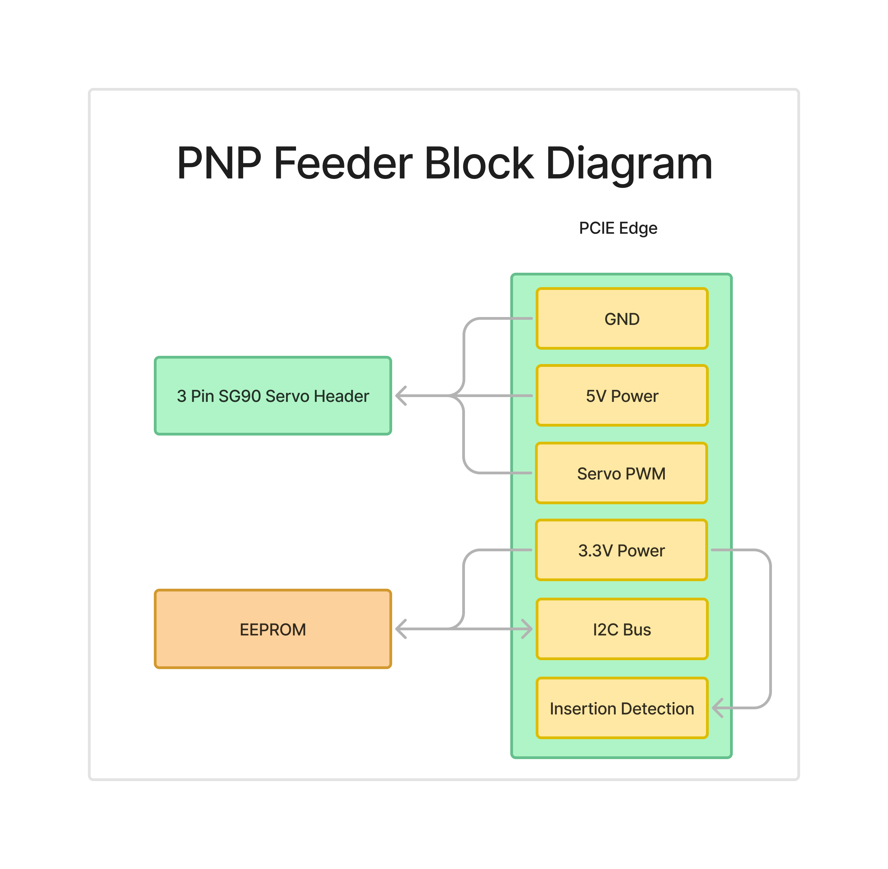

# Pick and Place Feeder Design Goals

## Overview

The aim of this project is to design a powered and addressable pick and place feeder that addresses the limitations found in current systems, such as the Neoden 4. The main issues with the Neoden 4 are the fixed feeders, which require parts to be inserted or removed directly while the machine is in operation, making it cumbersome and time-consuming. Additionally, the lack of preloaded cartridges means it often takes longer to load components than to place them manually.

This project aims to solve these challenges by providing an easy-to-use, modular, and affordable feeder system that can be used with both the Neoden 4 and Lumen PnP machines.

## Design Goals

1. **Compatibility**
   - Design a powered, addressable pick and place feeder compatible with Neoden 4 and Lumen PnP machines.
   - Support component sizes down to 0402.

2. **Low Cost**
   - Keep the BOM cost per feeder unit under $10 to make the solution accessible and affordable for hobbyists and small manufacturers.

3. **Fast Production**
   - Limit 3D printing time per unit to less than 2 hours using a standard consumer-grade 3D printer.
   - Assembly time less than 10 minutes per feeder

4. **Ease of Use**
   - Ensure quick part loading to minimize the setup time.
   - Allow preloaded cartridges for efficient part swapping, avoiding the need to load components directly into the machine.

5. **Scalability**
   - Support up to 256 feeders on a single master device to enable integration into a larger inventory system, such as with InvenTree.

## Block Diagrams

Below are some block diagrams illustrating the system and feeder design:

The system block diagram illustrates the two main boards involved in the design: the feeder and the backplane. The backplane contains a master controller that distributes power and uses a CAN physical interface for UART communication, sending Modbus data packets to each of the feeders. The backplane supports 8 addressing bits per feeder, allowing up to 256 feeders to be connected to a single master controller. This scalability makes the system suitable for use as an inventory system. Power can be supplied at either 24V or 12V.

The feeder block diagram shows that each feeder is equipped with an RP2040 microcontroller, which controls an SG90 servo motor responsible for advancing the tape forwards. The RP2040's flash memory is used to store key information for each feeder, including the MPN (Manufacturer Part Number), quantity, and footprint of the components being fed.