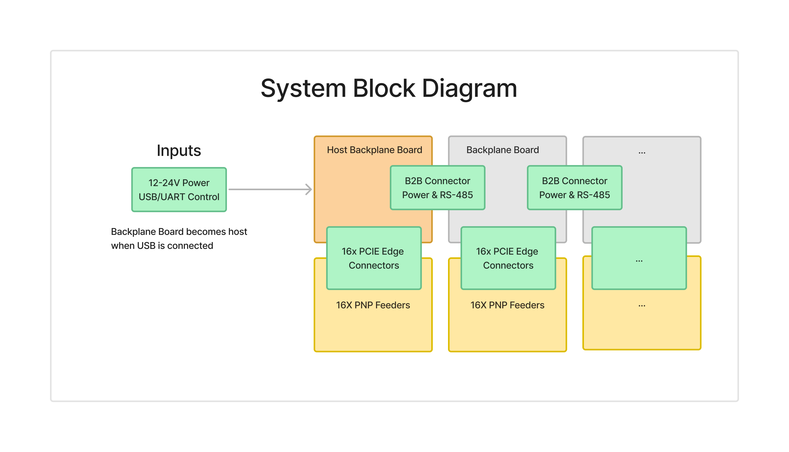

# Pick and Place Feeder Design Goals

## Design Goals

1. **Compatibility**
   - Design a powered, pick and place feeder compatible with Neoden 4 and OpenPNP machines.
   - Support component sizes down to 0402.

2. **Low Cost**
   - Keep the BOM cost per feeder unit under $10 to make the solution accessible and affordable for hobbyists and small manufacturers.

3. **Fast Production**
   - Limit 3D printing time per unit to less than 2 hours using a standard consumer-grade 3D printer.
   - Assembly time less than 10 minutes per feeder

4. **Ease of Use**
   - Ensure quick part loading to minimize the setup time.
   - Allow preloaded cartridges for efficient part swapping, avoiding the need to load components directly into the machine.

5. **Scalability**
   - Support up to 256 feeders on a single master device to enable integration into a larger inventory system, such as with InvenTree.

## Block Diagrams

Below are some block diagrams illustrating the system and feeder design:

The system block diagram illustrates the three main boards involved in the design: the feeder, backplane controller and backplane distribution board. The backplane contains a master controller that distributes power and uses a CAN physical interface for UART communication, sending Modbus data packets to the distrubiton boards which go to each of the feeders. The backplane supports 8 addressing bits per feeder, allowing up to 256 feeders to be connected to a single master controller. This scalability makes the system suitable for use as an inventory system. Power can be supplied at either 24V or 12V.

Each feeder uses a RP2040 microcontroller, which controls an SG90 servo motor responsible for advancing the tape forwards, a connector to support OpenPNP compatible machines as well as the neoden4.

The backplane controller is designed to communicate with either a PNP or PC to be the master device controlling the feeders. Its main goal is to read the UART commands and forward the command to the appropriate feeder through the CAN interface. It also has a USB A interface so a barcode scanner can be connected and read in the MPN, quantity and PO from a digikey or mouser component bag, and store that data on the feeder.

The backplane distribution is a board that can be daisy-chained to support connecting up to 256 feeders from a single controller. It uses 16 PCIE edge connectors to connect to the feeders, and each feeder has 8 addressing bits so each feeder can be uniquely identified.